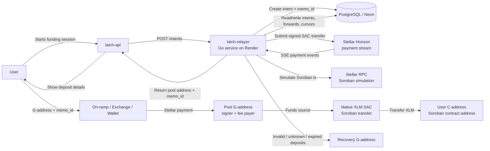
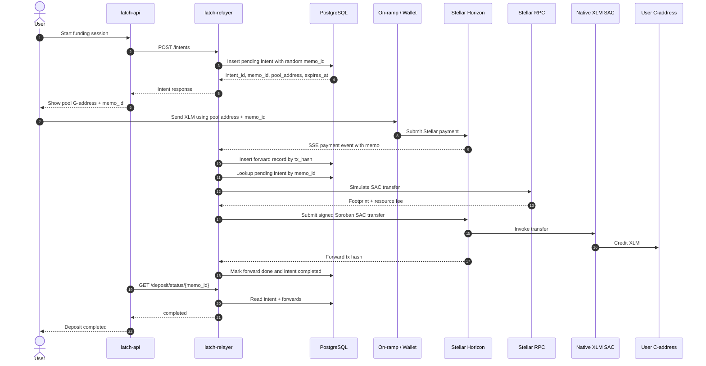
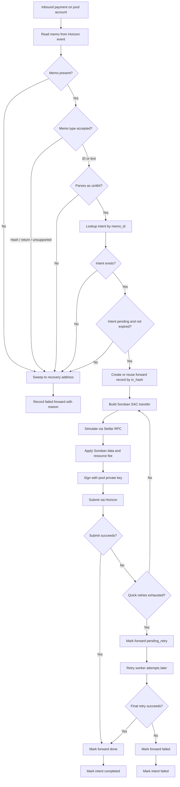
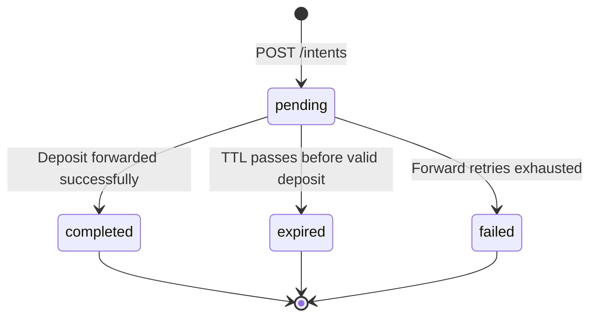
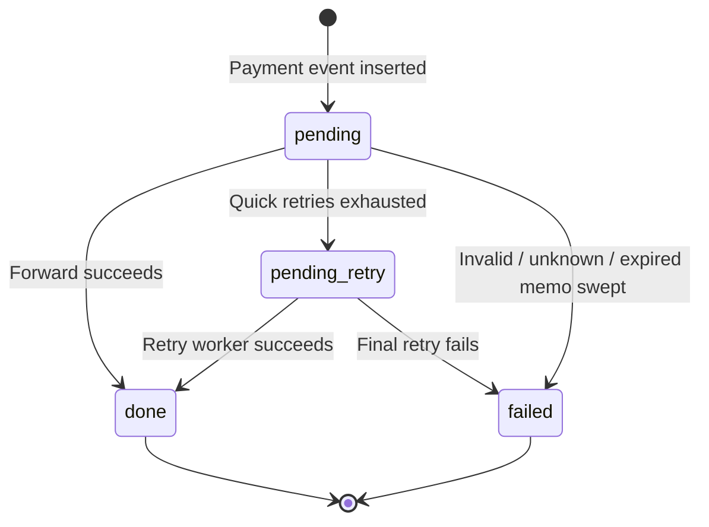
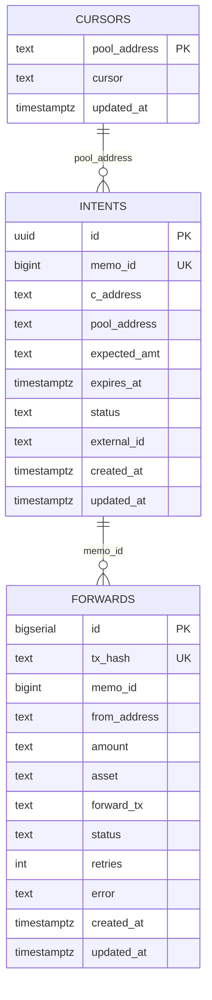
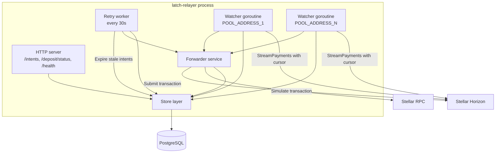
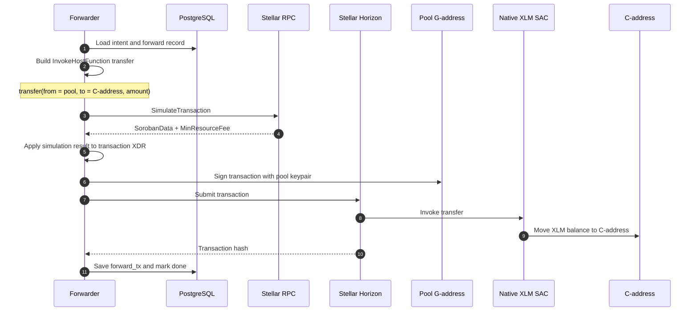
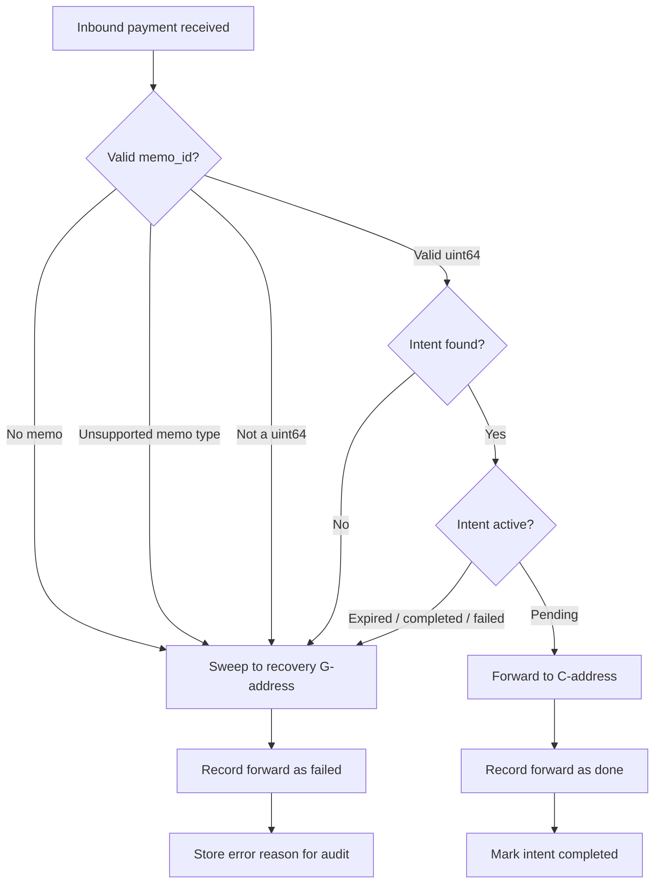

# Latch Relayer Architecture Diagrams

GitHub renders Mermaid diagrams natively in Markdown files. Each diagram below is intentionally focused on one question so the architecture stays easy to explain and maintain.

## 1. System Context

This shows where `latch-relayer` sits in the broader Latch and Stellar system.

## 2. Happy Path Sequence

This is the normal successful flow from intent creation through deposit forwarding.

## 3. Deposit Forwarding Decision Flow

This shows how each inbound payment is classified.

## 4. Intent Lifecycle

This shows the state machine for funding intents.

## 5. Forward Record Lifecycle

This shows how inbound payment records move through the retry path.

## 6. Database Model

This captures the three core tables and their operational relationships.

## 7. Runtime Workers

This shows the internal shape of the Go process.

## 8. Soroban SAC Forwarding

This explains why forwarding to a C-address is a Soroban invocation rather than a classic Stellar payment.

## 9. Invalid Deposit Recovery

This isolates the recovery path for deposits that cannot safely be matched to an active intent.

## Suggested Reading Order

1. System Context
2. Happy Path Sequence
3. Deposit Forwarding Decision Flow
4. Intent Lifecycle and Forward Record Lifecycle
5. Database Model
6. Runtime Workers
7. Soroban SAC Forwarding
8. Invalid Deposit Recovery
